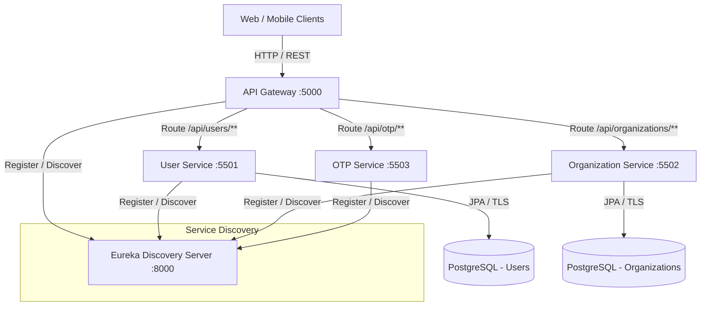

# Orion Microservices Platform

An enterprise-grade, cloud-native microservices backend architecture built with **Java 17**, **Spring Boot 3.4+ / 4.1+**, and **Spring Cloud 2024/2025**.

---

## 🏛️ System Architecture



---

## 📦 Services Breakdown

| Service Name | Default Port | Description | Database / Store |
| :--- | :---: | :--- | :--- |
| **eureka-server** | `8000` | Netflix Eureka Service Registry & Discovery Server | In-memory Registry |
| **api-gateway** | `5000` | Spring Cloud Gateway (MVC), JWT Authentication, Reverse Proxy, Route Forwarding | Stateless (JWT) |
| **user-service** | `5501` | User registration, user profile management, internal credential lookups | PostgreSQL |
| **organization-service** | `5502` | Organization management, projects lifecycle, multi-tenant credential lookups | PostgreSQL |
| **otp-service** | `5503` | One-Time Password (OTP) generation, delivery, and verification | In-memory / Redis |

---

## 🧭 Gateway Routing & Endpoints

All external incoming traffic enters through the **API Gateway** (`http://localhost:5000`):

| Method | Path Pattern | Target Service | Purpose / Auth |
| :--- | :--- | :--- | :--- |
| `POST` | `/api/auth/login/individual` | API Gateway (Local) | Individual user login (issues access & refresh JWT) |
| `POST` | `/api/auth/login/organization` | API Gateway (Local) | Organization login (issues access & refresh JWT) |
| `POST` | `/api/auth/refresh` | API Gateway (Local) | Refresh expired access token |
| `POST` | `/api/auth/logout` | API Gateway (Local) | Revoke token and blacklist |
| `*` | `/api/users/**` | `lb://user-service` | User CRUD operations |
| `*` | `/api/organizations/**` | `lb://organization-service` | Organization & Project CRUD operations |
| `*` | `/api/otp/**` | `lb://otp-service` | OTP verification operations |

---

## 📁 Enterprise Project Layout

```
springboot-microservices/
├── .mvn/                                # Maven wrapper configuration
├── .gitignore                           # Enterprise-level gitignore rules
├── .env.example                         # Environment variable template
├── docker-compose.yml                   # Container orchestration
├── mvnw / mvnw.cmd                      # Root Maven wrapper scripts
├── pom.xml                              # Root multi-module aggregator POM
├── README.md                            # Architecture & developer documentation
│
├── eureka-server/                       # Service Discovery (Eureka)
│   ├── Dockerfile
│   ├── pom.xml
│   └── src/
│
├── api-gateway/                         # API Gateway & Central Auth Service
│   ├── Dockerfile
│   ├── pom.xml
│   └── src/main/java/com/orion/api_gateway/
│       ├── client/                      # Microservice HTTP Clients
│       ├── config/                      # Security & Gateway Configurations
│       ├── controller/                  # Auth & Gateway Controllers
│       ├── dto/                         # Request & Response DTOs
│       ├── exception/                   # Global exception handling
│       └── service/                     # JWT and Token Management Services
│
├── user-service/                        # User Management Service
│   ├── Dockerfile
│   ├── pom.xml
│   └── src/main/java/com/orion/user_service/
│       ├── config/                      # Application configs
│       ├── controller/                  # REST API & Internal Controllers
│       ├── dto/                         # Request & Response Transfer Objects
│       ├── exception/                   # Error handling & advice
│       ├── model/                       # Persistent JPA Entities (User)
│       ├── repository/                  # Spring Data JPA Repositories
│       ├── service/                     # User business logic
│       └── worker/                      # Background asynchronous workers
│
├── organization-service/                # Organization & Project Service
│   ├── Dockerfile
│   ├── pom.xml
│   └── src/main/java/com/orion/organization_service/
│       ├── config/                      # Application configs
│       ├── constant/                    # Enums & Status Constants
│       ├── controller/                  # Organization & Project REST Controllers
│       ├── dto/                         # Request & Response Transfer Objects
│       ├── exception/                   # Error handling & advice
│       ├── model/                       # Persistent JPA Entities (Organization, Project)
│       ├── repository/                  # Spring Data JPA Repositories
│       ├── service/                     # Organization & Project business logic
│       ├── util/                        # Unique code & key generators
│       └── worker/                      # Background asynchronous workers
│
└── otp-service/                         # OTP Lifecycle Service
    ├── Dockerfile
    ├── pom.xml
    └── src/
```

---

## 🚀 Getting Started

### Prerequisites
- **JDK 17** or higher
- **Docker & Docker Compose** (optional for containerized run)

### 1. Build All Services
To build all microservices at once using the root aggregator POM:
```bash
./mvnw clean compile
```

To run all unit and integration test suites:
```bash
./mvnw test
```

To package all services into runnable JARs:
```bash
./mvnw clean package -DskipTests
```

### 2. Running Locally (Directly with Java)
Start services in the following order:
1. **Eureka Discovery Server**
   ```bash
   cd eureka-server && ./mvnw spring-boot:run
   ```
2. **Backing Microservices** (in separate terminals)
   ```bash
   cd user-service && ./mvnw spring-boot:run
   cd organization-service && ./mvnw spring-boot:run
   cd otp-service && ./mvnw spring-boot:run
   ```
3. **API Gateway**
   ```bash
   cd api-gateway && ./mvnw spring-boot:run
   ```

### 3. Running with Docker Compose
To build and launch all containers simultaneously:
```bash
docker-compose up --build
```
To stop all services:
```bash
docker-compose down
```

---

## 🔒 Configuration & Environment Variables

Copy `.env.example` to `.env` to configure properties without modifying code:
```bash
cp .env.example .env
```

| Variable | Description | Default Fallback |
| :--- | :--- | :--- |
| `EUREKA_SERVER_URL` | Eureka Service Registry endpoint | `http://localhost:8000/eureka/` |
| `JWT_SECRET` | 256-bit Base64-encoded secret key | Built-in dev secret |
| `JWT_ACCESS_EXPIRATION` | Access token lifespan in ms | `900000` (15 mins) |
| `JWT_REFRESH_EXPIRATION` | Refresh token lifespan in ms | `604800000` (7 days) |
| `USER_DB_URL` | PostgreSQL connection string for User Service | Supabase pooler URL |
| `USER_DB_USERNAME` | PostgreSQL username | Supabase user |
| `USER_DB_PASSWORD` | PostgreSQL password | Configured password |
| `ORG_DB_URL` | PostgreSQL connection string for Organization Service | Neon pooler URL |
| `ORG_DB_USERNAME` | PostgreSQL username | Neon owner |
| `ORG_DB_PASSWORD` | PostgreSQL password | Configured password |